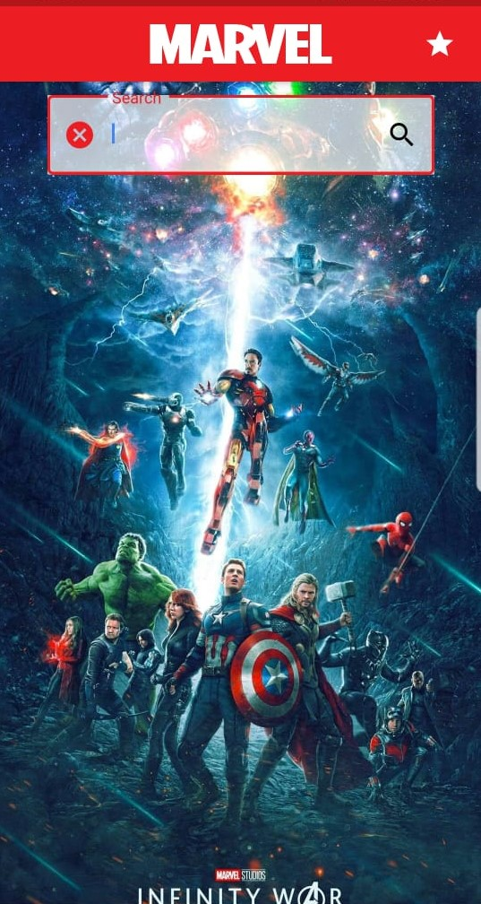
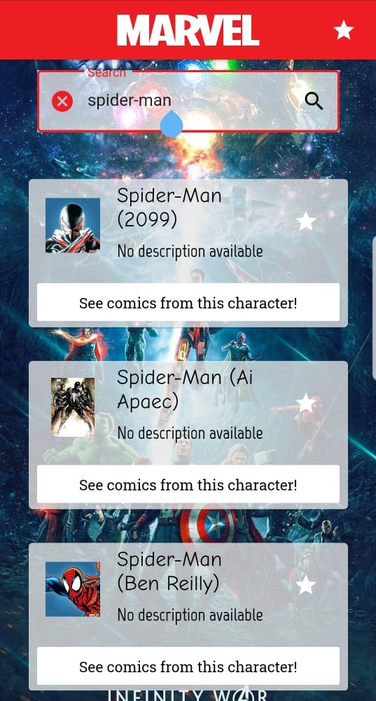
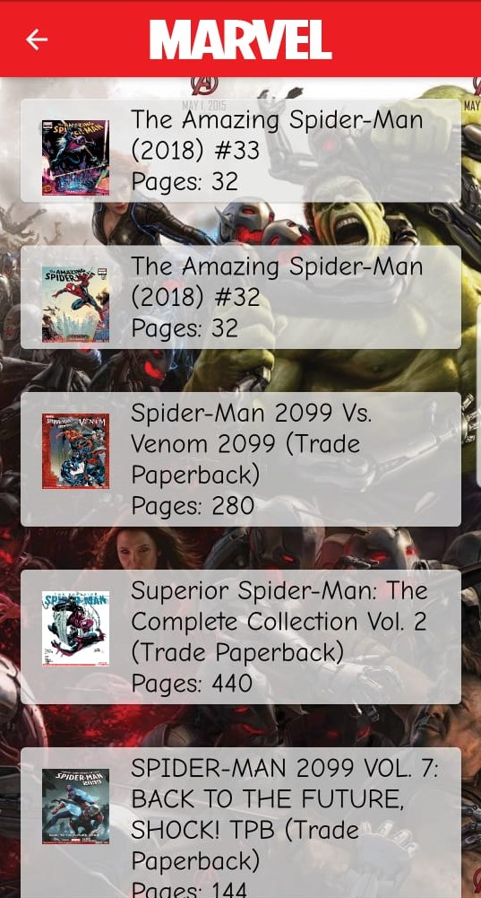
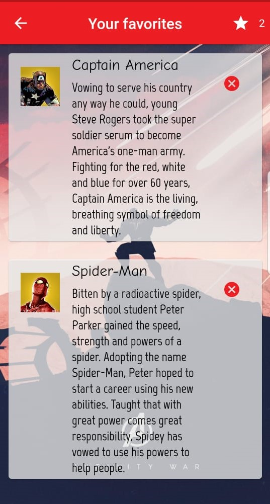

# Heroes from Marvel - Flutter Application

 
 

## About this project

The idea of this app is : 
*Display marvel heroes and their respectives comics* 
The app make the requests from the Marvel's open API, available at : https://developer.marvel.com/documentation/getting_started

## Why ?

This project is part of my personal portfolio, it was made to increase my development skills.

## Functionalities

- Search for heroes by name.
- Add them to your favorites.
- See the comics they were part of.